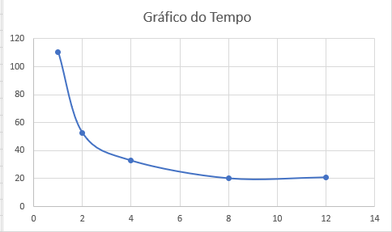
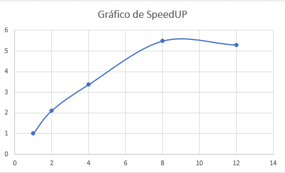
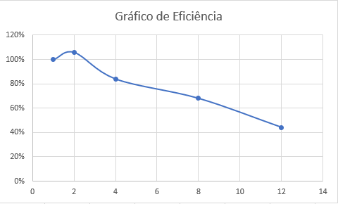

# Relatório da Atividade 3 - Paralelizar e avaliar o desempenho de um analisador de log

**Disciplina:** PROGRAMAÇÃO CONCORRENTE E DISTRIBUÍDA
**Aluno(s):** MATEUS RECALDE DA FONSECA COTRIM
**Professor:** RAFAEL MARCONI RAMOS
**Data:** 25/03/2026

---

# 1. Descrição do Problema

O programa desenvolvido processa arquivos de log e calcula estatísticas: número de linhas, palavras, caracteres e a contagem das palavras-chave erro, warning e info.
- Problema implementado: análise de grandes volumes de texto.
- Algoritmo utilizado: leitura sequencial de arquivos e contagem de tokens.
- Tamanho da entrada: 1000 arquivos, total de 10 milhões de linhas e 200 milhões de palavras.
- Objetivo da paralelização: reduzir o tempo de execução distribuindo o processamento entre vários processos.

---

# 2. Ambiente Experimental

| Item                        | Descrição          |
| --------------------------- | ------------------ |
| Processador                 | Core i5-12500      |
| Número de núcleos           | 6 físicos          |
| Memória RAM                 | 16 GB              |
| Sistema Operacional         | Windows 11         |
| Linguagem utilizada         | Python 3           |
| Biblioteca de paralelização | concurrent.futures |
| Compilador / Versão         | CPython            |

---

# 3. Metodologia de Testes

Os experimentos foram conduzidos para avaliar o desempenho do programa em diferentes configurações de paralelização.
- Medição do tempo: o tempo total de execução foi medido utilizando a função time.time() do Python.
- Número de execuções: cada configuração (1, 2, 4, 8 e 12 processos) foi executada uma vez.
- Cálculo da média: como foi apenas uma execução por configuração, o tempo registrado foi considerado diretamente como resultado.
- Tamanho da entrada: foram utilizados 1000 arquivos de log, contendo no total 10 milhões de linhas e aproximadamente 200 milhões de palavras.

- As execuções foram realizadas em uma máquina dedicada, porém com algumas aplicações abertas (Excel, VS Code e navegador com 3 abas).
- As condições foram mantidas iguais para todas as execuções, garantindo comparabilidade dos resultados.

---

# 4. Resultados Experimentais

| Nº Threads/Processos | Tempo de Execução (s) |
| -------------------- | --------------------- |
| 1                    | 110,61                |
| 2                    | 52,5                  |
| 4                    | 32,85                 |
| 8                    | 20,18                 |
| 12                   | 20,91                 |

---

# 5. Cálculo de Speedup e Eficiência

## Fórmulas Utilizadas

### Speedup

```
Speedup(p) = T(1) / T(p)
```

Onde:

* **T(1)** = tempo da execução serial
* **T(p)** = tempo com p threads/processos

### Eficiência

```
Eficiência(p) = Speedup(p) / p
```

Onde:

* **p** = número de threads ou processos

---

# 6. Tabela de Resultados

| Threads/Processos | Tempo (s) | Speedup | Eficiência |
| ----------------- | --------- | ------- | ---------- |
| 1                 | 110,61    | 1,00    | 100%       |
| 2                 | 52,50     | 2,11    | 106%       |
| 4                 | 32,85     | 3,37    | 84%        |
| 8                 | 20,18     | 5,48    | 68%        |
| 12                | 20,91     | 5,29    | 44%        |

---

# 7. Gráfico de Tempo de Execução



---

# 8. Gráfico de Speedup



---

# 9. Gráfico de Eficiência



---

# 10. Análise dos Resultados

- O tempo caiu de 110s para ~20s com paralelização.
- O melhor resultado foi com 8 processos, que corresponde ao número de núcleos da máquina.
- Com 12 processos, o tempo não melhorou, mostrando sobrecarga (overhead).
- A eficiência caiu após 4 processos e despencou em 12.
- Principais causas: limite físico da CPU, coordenação entre processos e leitura de disco.

---

# 11. Conclusão

- A paralelização reduziu o tempo de execução de 110s (serial) para cerca de 20s (paralelo).
- O melhor desempenho foi obtido com 8 processos, compatível com o número de núcleos físicos da máquina.
- A eficiência foi alta até 4 processos, mas começou a cair a partir daí, mostrando o impacto do overhead.
- Com 12 processos, não houve ganho adicional, pois o número de processos ultrapassou os núcleos disponíveis.
- Principais fatores de perda de desempenho: coordenação entre processos, leitura de disco e limite do hardware.
- O programa mostrou boa escalabilidade até o limite físico da CPU, confirmando que a paralelização é eficaz.
- Possíveis melhorias: otimizar divisão de tarefas, reduzir sobrecarga de comunicação e considerar uso de threads para operações de I/O.

---